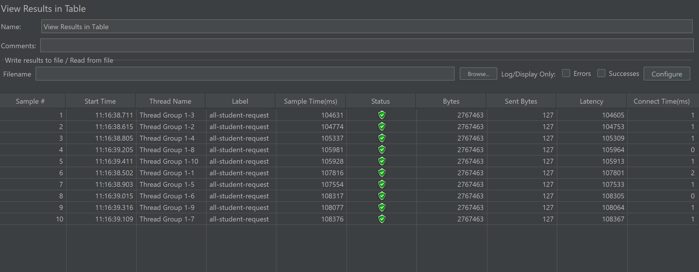
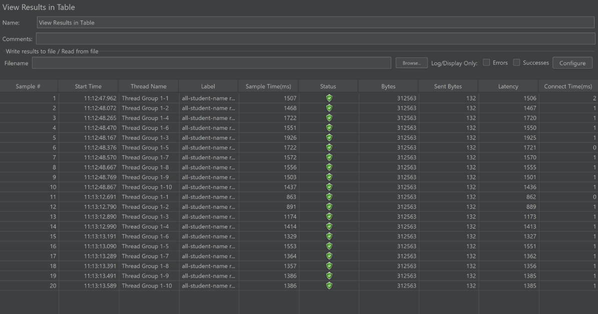
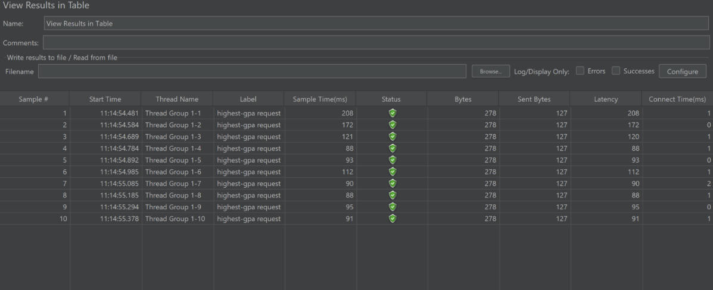
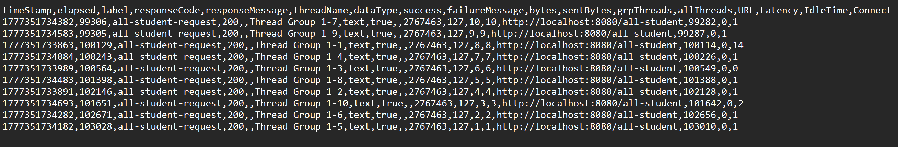
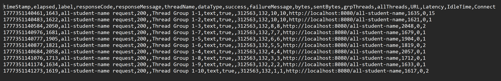
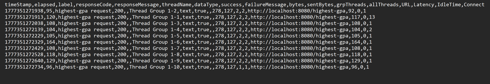

# Reflection

1. Perbedaan antara JMeter dan IntelliJ Profiler dalam approach pada testing

- **JMeter** berperan sebagai external user, menghitung total waktu dalam merespon (latency, network overhead, and server processing).
- **IntelliJ Profiler** melihat dari dalam kode (internal) untuk menghitung waktu eksekusi dari method tertentu.

2. Identifikasi _Weak Point_

- Profiling menyediakan fitur "_Call Tree_" dan "_Flame Graph_". Secara visual memperlihatkan fungsi yang dijalankan dan waktu yang dibutuhkan untuk tiap method.
Ia juga menyediakan fitur "_Method List_" dalam bentuk table sehingga bisa lebih mudah untuk dicari.

3. Ya, karena dengan fitur yang disediakan oleh IntelliJ Profiler, kita bisa melihat berapa waktu yang dibutuhkan untuk mengeksekusi method-method yang ada di code. 
Lalu juga ada fitur pembantu seperti comparison view sehingga perubahan dalam performance (waktu eksekusi) pada tiap method dapat terlihat dengan jelas.
4. Tantangan & Solusi  

- Tantangan utama yang ditemui adalah kode yang tidak dioptimasi dengan baik membutuhkan waktu yang lama saat di eksekusi dan perlu diidentifikasi terlebih dahulu lokasi bottlenecknya. 
- Solusinya adalah dengan melihat fungsi yang dieksekusi ketika mengirim request ke endpoint tertentu lalu merefactor dan mengoptimasi fungsi yang memakan waktu lama.

5. Keuntungan Utama dalam menggunakan IntelliJ Profiler dalam profiling

- Ada fitur perbandingan side-by-side yang menampilkan old execution time dan new execution time serta persentase perubahan yang terjadi.
- Membedakan antara Total time dengan CPU Time.

6. Jika performace testing pada JMeter tidak konsisten dengan intelliJ Profiler profiling, maka kemungkinan ada masalah di internet atau database latency.
7. Strategi Optimisasi & Test Fungsionalisasi

- Mengubah loop menjadi menggunakan Join Fetches (menggunakan @Query("SELECT sc FROM StudentCourse sc JOIN FETCH sc.student JOIN FETCH sc.course")) untuk fungsi getAllStudentsWithCourses. Menggunakan @Query karena jika menggunakan metode query berdasarkan nama metode, akan lambat karena hasil data dari fungsi ini mempunyai skala yang besar.
- Menggunakan query berdasarkan nama metode (findFirstByOrderByGpaDesc()). Ini bisa dilakukan karena mengextend JPA dan hasil data yang diinginkan hanya dalam skala kecil untuk fungsi findStudentWithHighestGpa().
- Mengganti string concatination dengan stream. String concatination bersifat immutable sehingga setiap kali join, perlu membuat objek baru. Sedangkan, stream menggunakan StringBuilder yang secara internal bersifat mutable, sehingga jauh lebih cepat dan efisien.

- Untuk melihat apakah fungsi masih sesuai dengan yang lama atau tidak bisa dilihat dari hasil endpoint yang diberikan dari kedua fungsi (sebelum & sesudah optimisasi).

# [GUI] Test Results for endpoint (/all-student)  

# [GUI] Test Results for endpoint (/all-student-name)

# [GUI] Test Results for endpoint (/highest-gpa)

# [CLI] Test Results for endpoint (/all-student)

# [CLI] Test Results for endpoint (/all-student-name)

# [CLI] Test Results for endpoint (/highest-gpa)

